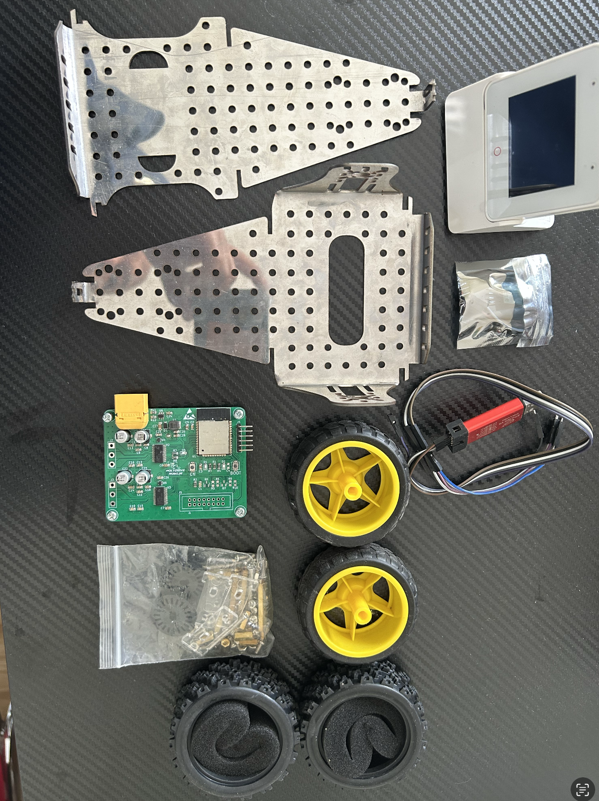
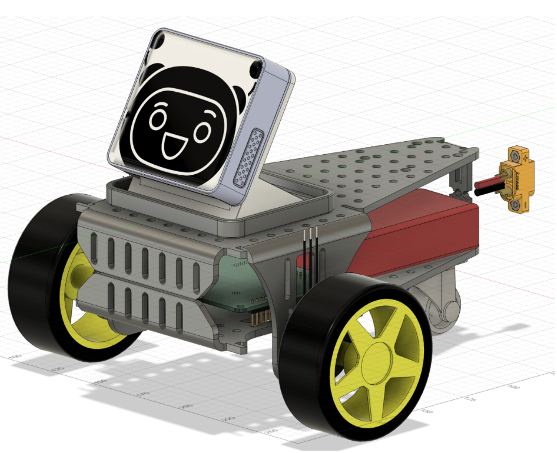

# Sophia Robot

Robot beroda untuk edukasi anak sekolah dasar

## Daftar Isi

- [Tentang](#Tentang)
- [Getting Started](#getting_started)
- [Usage](#usage)
- [Contributing](../CONTRIBUTING.md)

## Tentang 

Proyek ini adalah pengembangan robot edukasi interaktif yang dirancang untuk membantu siswa di jenjang pendidikan dasar. Robot ini dilengkapi dengan kemampuan interaksi sosial seperti ekspresi wajah dan suara, serta teknologi IoT yang memungkinkan kontrol dan pemrograman robot secara mudah melalui smartphone. Proyek ini bertujuan untuk meningkatkan pengalaman belajar siswa di bidang STEM (Science, Technology, Engineering, Math) dengan pendekatan yang inovatif, menarik, dan sesuai dengan kebutuhan era digital.Write about 1-2 paragraphs describing the purpose of your project.

## Getting Started 

